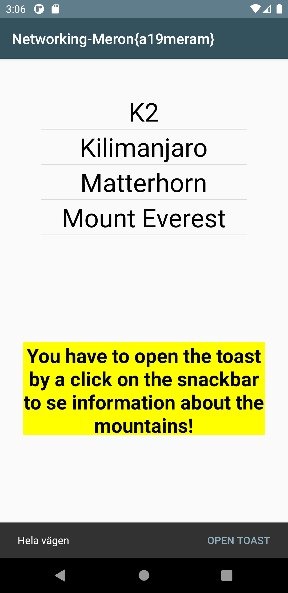
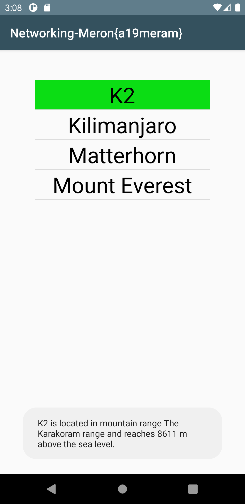

# Rapport

**Skriv din rapport här!**

Den här duggan gick ut på att man ska använda sig av en layout listview för att kunna skriva ut de olika json data som vi fick länk till av lärarna. 
Sedan ska man göra en klass för att kunna sedan använda den med hjälp av en adapter där dessa används som en member variabel. 
Eftersom klass strulade för mig och ledde till att jag fick mer error meddelande och syntaxfel valde jag att kalla på url:en direkt i JsonTask som vi fick färdigt av kurs läraren. 
Detta ledde dock tilla att belastningen av kod blev väldigt mycket i onPostExecute, det vill säga att denna metod ska göra en sak i taget för att förbättra strukturen i koden annars kommer det att leda till s.k. “spaghetti kod”. 
Därför fick jag hjälp av Daniel för att skapa en klass och sedan omplacerade jag koden så att det passar in till en rätt metod och för att kunna exekvera utan att det uppstår syntaxfel. 

Koden som visas ner tillhör exemplet av resultatet som visas i figur 1. 
Det vill säga att man använder en snackbar med en onclickListener för att kunna godkänna innan man börjar trycka på de olika bergnamn, 
så fort man öppnar toast i snackbar kommer man få möjligheten att se information om de olika färgerna i form av toast meddelande.


```
make.setAction("Open Toast", new View.OnClickListener() {
            @Override
            public void onClick(View view) {
                my_listview.setOnItemClickListener(new AdapterView.OnItemClickListener() {
                    @Override
                    public void onItemClick(AdapterView<?> parent, View view, int position, long id) {
                        String name = mountainArrayList.get(position).getName("name");
                        String location = mountainArrayList.get(position).getLocation("Location");
                        int size = mountainArrayList.get(position).getSize("size");
                        String meddelande = name + " is located in mountain range " + location + " and reaches " + size + " m above the sea level.";
                        Toast.makeText(MainActivity.this, meddelande, Toast.LENGTH_LONG).show();
                        view.setSelected(true);
                    }
                });
                textView_info.setVisibility(View.INVISIBLE);
            }
        });
        make.show();
```

Bilder läggs i samma mapp som markdown-filen.




